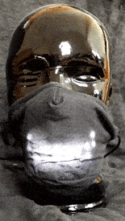
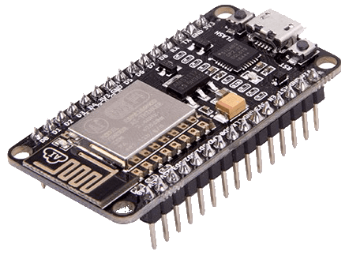
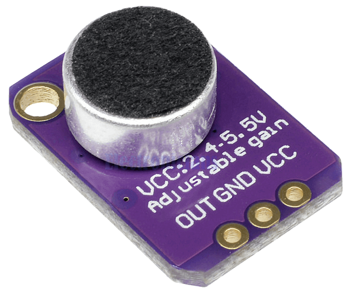
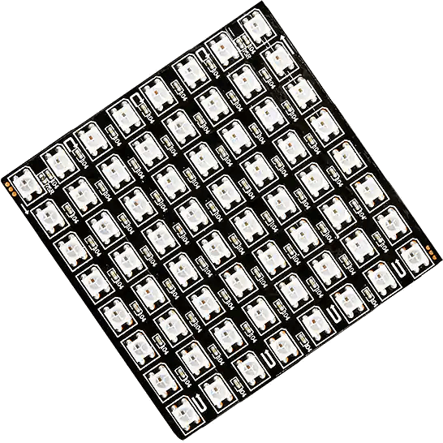
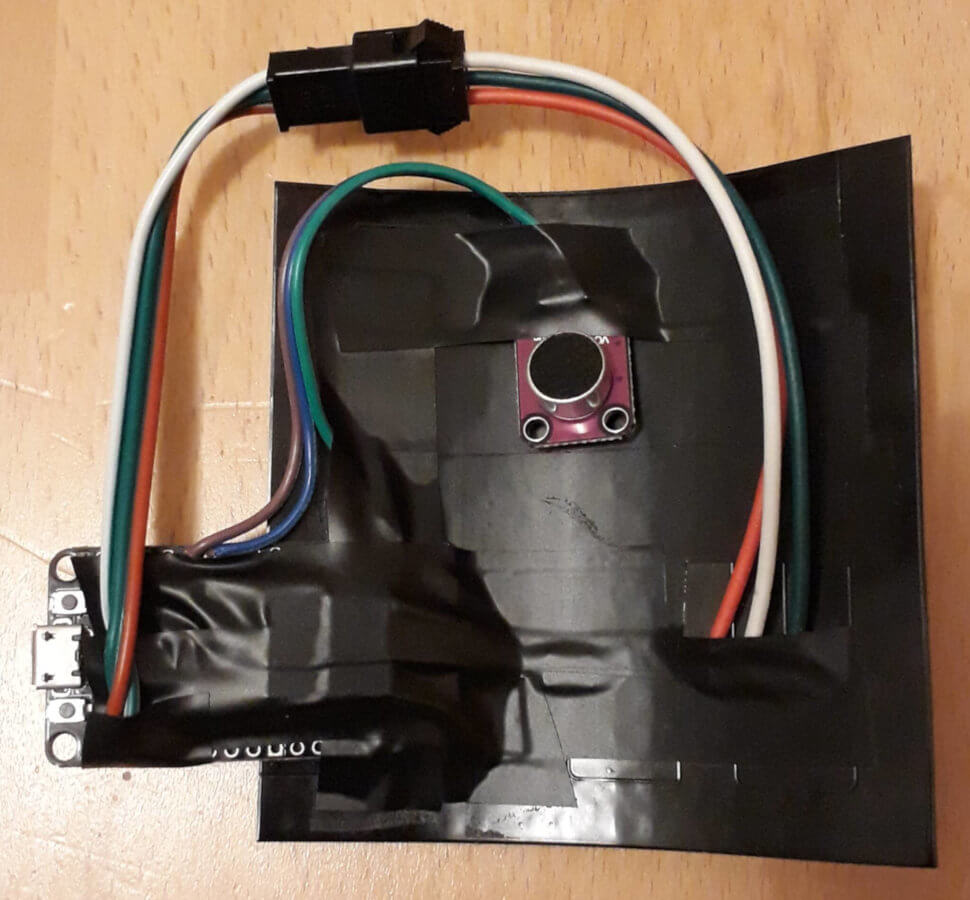
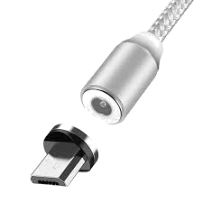
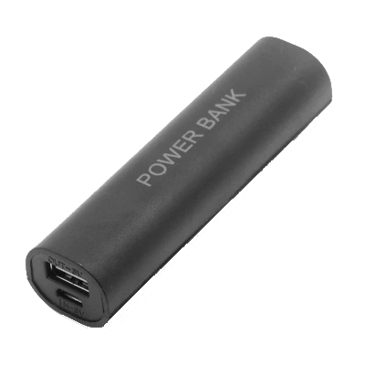

# Ze Voice Mask

<table>
<tr>
<td width="75%" valign="top">

This is an open source DIY implemetation of a face mask with voice visuals.
It features a microphone and a 8x8 matrix LED screen.
In normal operation it shows a mouth on the screen that moves its lips according to your voice.
The talking mouth features different graphical effects which change from time to time.
When you do not talk for a while, it plays some animations every now and then.

Put it in the pocket of your face mask and show people your smile.

> **CAUTION** When you put electrical parts near your face,
> they get rather warm. You risk burning your face!
> Especially in the event of a short circuit.
> Educate other people of the dangers before use.
> Act responsibly, stay safe.

> **NOTE** Do not put the plain electronics in front of your nose and mouth.
> Always have some cloth between. Sanitize cloth and electronics alike.

</td>
<td>

</td>
</tr>
</table>

## Hardware

First of all, you will need a face mask made of cloth.
It should feature a pocket where you can put the electronics in.
A pocket size for a standard PM2.5 air filter is enough.
Since the electronics are rather heavy, the mask should be durable,
so that it can carry the weight without breaking anything.
That also means you will need strong ear straps or a loop around the neck
to not drop the mask.
A tube scarf has proven to be working well in practice.
It hides the cables and holds the electronics when you pull down the mask.

Besides that, you will need to assemble the following electronics parts:

<table>
<tr>
<td width="75%">

*   ESP8266 NodeMCU DevBoard

    The ESP8266 uses 3.3V voltage on the power rails, as well as the GPIO pins.
    In contrast to Arduinos, there is no need for level shifters.
    All peripherals can be connected right away.

    The only drawback is with the onboard LDO the maximum current draw is 1000mA.
    But that can be easily taken care of in software.

    Get a version without pin headers already attached.

</td>
<td>

</td>
</tr>
<tr>
<td width="75%">

*   Microphone sensor (MAX4466) breakout board with a rotary potentiometer

    Connect the sensor's *OUT* pin to the *A0* pin on the NodeMCU board.
    Connect the sensor's *VCC* and *GND* pins to their respective *3.3V* and *GND* pins on the NodeMCU board.

    Adjust the potentiometer to almost minimum gain.
    Play a bit around to find a good value.

</td>
<td>

</td>
</tr>
<tr>
<td width="75%">

*   8x8 matrix LED based on WS2812B ECO (ideally with a flexible board)

    Make sure to get the ECO variant of the LED matrix. It consumes less electricity.
    All components are connected to the same LDO regulator on the NodeMCU board.
    The ECO variant causes less feedback into other components.
    That leads to more accutate microphone sensor readings.

    Connect the matrix's *DIN* (data in) pin with the *RX* pin (aka. *D9*) on the NodeMCU board.
    Connect the matrix's *5V*/*VCC* and *GND* pins to their respective *3.3V* and *GND* pins on the NodeMCU board.

    In your final setup, the matrix might have another layout.
    You will need to adjust the NeoTopology in the code.

</td>
<td>

</td>
</tr>
</table>

This is how the final hardware setup looks like.

Prepare the LED matrix board.
All components are going to be attached to it.
Deburr the edges of the board with a file.
Cover the back of the board with electrical tape so that broken components can be easily removed.

Solder the parts and put everything in place on the backside of the LED matrix board.
Make sure that the mouth has the correct orientation before fixing anything.
Let the NodeMCU board stick out a little at one end, so that the flexible LED matrix can actually bend.
That makes the NodeMCU run along your cheek.
Note however that when you connect a USB cord, the NodeMCU will be pulled down a little.
Best is to hot-glue it to the backside of the LED panel.
Place the microphone top-center of the LED matrix board. This way it is closest to your mouth.
Fix it in a way that you are still able to adjust the gain.

At the end, fix and isolate everything with electrical tape.

The following additional pieces are required:

<table>
<tr>
<td width="75%">

*   Micro-USB cable

    Use a standard micro-USB cable.
    A USB cable that only supplies electricity is preferred for daily use.
    It is generally thinner and more flexible.
    A magnetic connector is recommended as strain relief on the USB port.
    This also makes it easier to connect the cable when you have everything
    in place in front of your mouth.

> **NOTE** A micro-USB cable with data pins is needed to flash the firmware.

</td>
<td>

</td>
</tr>
<tr>
<td width="75%">

*   Powerbank

    A basic USB powerbank will do.
    There is no need for modern supplies with Quick Charge (QC) or Power Delivery (USB-PD).
    A small 5000mAh powerbank lasts for about 6h.

    Keep in mind that the LED matrix is demanding with respect to its power supply.
    Since the hardware design is meant to be kept easy, it has no capacitors.
    That shifts the pressure for a stable flow of current to the power supply.
    Make sure to get a good quality power supply.

    Minor quality powerbanks make the mouth move,
    although it is quiet and the microphone should have no input.

</td>
<td>

</td>
</tr>
</table>

## Software

This is an Arduino project based on [Platform.IO](https://platformio.org/). So install that first.
After you have set up the hardware, clone this repository, connect the NodeMCU board to a USB port
on your computer and simply flash the firmware.

    make flash

This builds a debug version by default. It includes serial output and other goodies that are mainly
useful for hacking. If you want to create a release version, run the following command instead.

    make flash RELEASE=true

## Frequenty Asked Questions

*   My mask does not have a separate pocket. Can I still use Ze Voice Mask?

    Sure, simply use two face masks and put Ze Voice Mask between them.
    Make sure it does not slip through the lower end.

*   I feel like I cannot breath under this thing.

    Well, technically this is not a question, but anyway.
    The electronics in front of your mouth and nose prevent good air flow.
    Additionally, they can get pretty hot. That may make it harder to breath.
    Take off the mask then and use a normal face mask.

*   What does *Ze* in the project name stand for?

    It is a homophone for the pronunciation of the word "the" with a thick German accent.

## Hacking

Arduino has the drawback that it always runs the *loop()* function,
even when there is nothing to do.
The ESP family of microcontrollers has a mechanism based on timer-events to schedule execution jobs.
This allows for cleaner code than using *millis()* and put everything into the *loop()* function.

Timers are implemented with a real hardware timer interrupt on ESPs.
The hardware timer always fires at the same interval.
This also allows us to put the CPU to a full halt when there is nothing to do.
This is *not* deep-sleep, but an idle sleep.
One drawback to this is that you need to wake up periodically,
otherwise the hardware watchdog will reboot the device.
In practice, this does not seem to be a problem (especially when you need to poll sensors).

The code uses the aweseome [NeoPixelBus](https://github.com/Makuna/NeoPixelBus) library.

Feel free to file bug reports or pull requests.

Happy hacking!

## History

This project came to life during the SARS-CoV2 world-wide pandemic in 2020.
